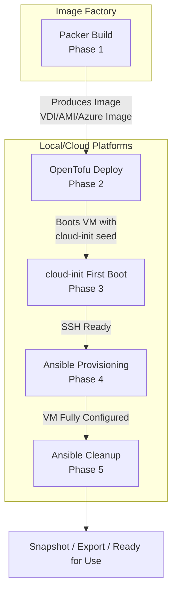

# Phase 1 — Image Build (Packer)
## Purpose: Convert an ISO into a reusable base image.
*Why this is portable:*
Packer supports VirtualBox, AWS AMIs, Azure Managed Images, QEMU, and more — same template, different builders.
**Typical workflow:**
- Packer template defines:
  - ISO source
  - Boot automation
  - cloud-init seed injection
  - Ansible provisioners (optional)
- **Output:**
  - VirtualBox: .vdi or .ova
  - AWS: AMI
  - Azure: Managed Image
**Portable artifacts:**
- Cloud-init seed ISO
- Base OS image
- SSH keys baked in

*NOTE:* Due to encoding issues with PowerShell, running the following command must be done in CMD - Windows command shell

```cmd
packer build -var-file=.\vars\ubuntu-24.04.pkrvars.hcl .\ubuntu-24.04.pkr.hcl
```

Optionally if using PowerShell, then invoke cmd and pass it
```powershell
cmd /c "packer build -var-file=.\vars\ubuntu-24.04.pkrvars.hcl .\ubuntu-24.04.pkr.hcl"
```

# Phase 2 — IaC Deployment (OpenTofu)
## Purpose: Create the VM, attach disks, configure networking, and boot it.
*Why this is portable:*
OpenTofu has providers for:
- VirtualBox
- AWS
- Azure
- VMware
- Proxmox
- QEMU
Same IaC patterns, different providers.
Typical workflow:
- main.tf defines:
  - VM size
  - Disk attachment
  - NICs
  - SSH access
- tofu apply → VM created on chosen platform
**Portable IaC patterns:**
- Variables for CPU/RAM
- Variables for image ID/path
- Modules for each platform

# Phase 3 — OS Installation Automation (cloud-init)
## Purpose: Automate first boot, user creation, package install, and base config.
*Why this is portable:*
cloud-init is the universal standard across:
- AWS
- Azure
- GCP
- OpenStack
- Local VMs (VirtualBox, QEMU, VMware)
Typical workflow:
- Packer injects user-data + meta-data
- VM boots → cloud-init runs:
- Create users
- Install packages
- Configure SSH
- Write files
- Run commands
Portable cloud-init modules:
- packages:
- runcmd:
- write_files:
- users:

# Phase 4 — First-Boot Provisioning (Ansible)
## Purpose: Apply configuration that is too complex or stateful for cloud-init.
*Why this is portable:*
Ansible works identically across:
- VirtualBox VMs
- AWS EC2
- Azure VMs
- Bare metal
- Containers
Typical workflow:
- Ansible inventory points to VM
- Playbooks configure:
- Hardening
- Application install
- Filesystems
- Services
- Monitoring agents
Portable patterns:
- SSH-based provisioning
- Idempotent tasks
- Role-based structure

# Phase 5 — Post-Install Cleanup (Ansible from Windows)
## Purpose: Run cleanup tasks from Windows after the VM is fully built.
*Why this is portable:*
Ansible can run from:
- Windows 11 (via WSL2)
- Linux
- CI/CD pipelines
And it can target:
- VirtualBox VMs
- AWS
- Azure
Typical workflow:
- Windows → WSL → Ansible
- Run:
ansible-playbook cleanup.yml
- Cleanup tasks:
- Remove temp files
- Reset logs
- Zero free space
- Remove SSH host keys (if templating)
- Final hardening
Portable cleanup strategy:
- Same playbook works everywhere
- Only inventory changes
